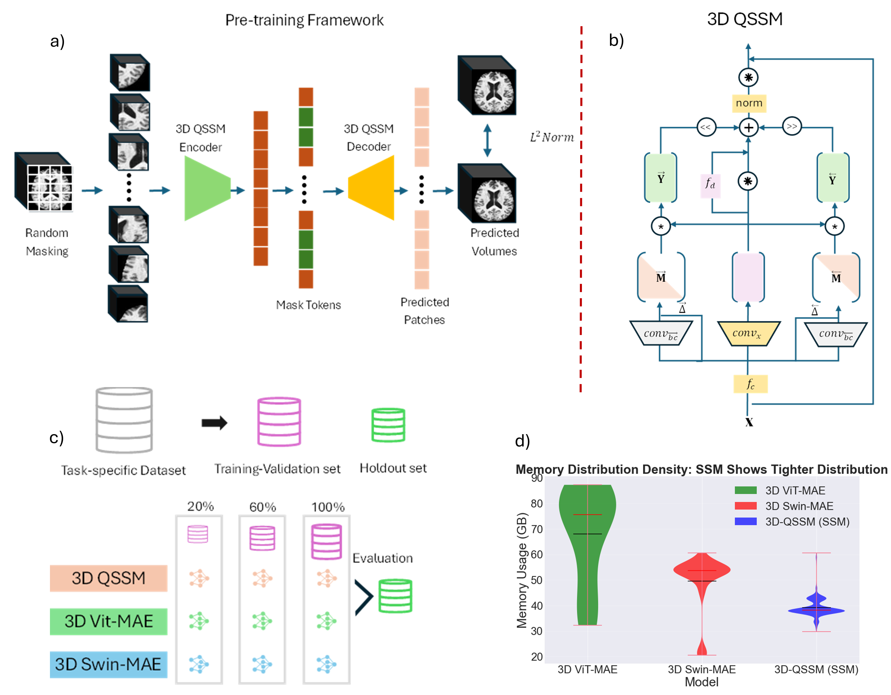

# 3D-QSSM

**3D-QSSM: A Quasi-Separable Vision State-Space Model for Scalable Foundation Models in Volumetric Medical Imaging**


<p align="center">
  
</p>

<p align="center">
  <b>Overview of the 3D-QSSM framework.</b>
</p>

This repository provides the implementation of **3D-QSSM**, a fully three-dimensional quasi-separable state-space model designed for scalable self-supervised learning in volumetric medical imaging.

The framework combines a bidirectional QSSM backbone with 3D masked autoencoder pretraining.

## Model Configuration

The default configuration used in the paper is:

* Input volume: `160 × 160 × 160`
* Patch size: `16 × 16 × 16`
* Number of tokens: `1000`
* Encoder depth: `12`
* Encoder embedding dimension: `384`
* Decoder depth: `12`
* Decoder embedding dimension: `192`
* Masking ratio: `75%`
  
## Hydra dependency

3D-QSSM uses the official Hydra implementation of bidirectional
quasiseparable state-space mixing:

https://github.com/goombalab/hydra

Hydra is included as an external dependency and should be installed
before running the 3D-QSSM models.

## Installation

3D-QSSM is intended to run on a **Linux system with an NVIDIA GPU and CUDA support**.

Clone the repository together with the Hydra submodule:

```bash
git clone --recurse-submodules https://github.com/Moona-Mazher/3D-QSSM.git
cd 3D-QSSM
```

Create a Python environment and install the core dependencies:

```bash
python -m venv .venv
source .venv/bin/activate

python -m pip install --upgrade pip
python -m pip install torch numpy einops nibabel
```

Install `mamba-ssm` in a CUDA-enabled environment:

```bash
python -m pip install mamba-ssm --no-build-isolation
```

> **Note:** `mamba-ssm` requires CUDA/NVIDIA build support and is not expected to install in a CPU-only Windows environment.

The official Hydra implementation is included as a Git submodule under:

```text
external/hydra
```
## Data Preparation

3D-QSSM expects preprocessed 3D MRI volumes in **NIfTI format** (`.nii` or `.nii.gz`).

The default model configuration uses:

* Input size: `160 × 160 × 160`
* Number of channels: `1`
* Patch size: `16 × 16 × 16`

The current dataset loader assumes that each MRI has already been spatially prepared to the expected model input size. It does **not** automatically perform registration, resampling, cropping, or resizing.

Example directory structure:

```text id="w5pzgm"
data/
├── subject_001.nii.gz
├── subject_002.nii.gz
├── subject_003.nii.gz
└── ...
```

The loader recursively searches for `.nii` and `.nii.gz` files.

Example:

```python id="7gkdnl"
from qssm.data.mri_dataset import MRIDataset, find_nifti_files

image_paths = find_nifti_files("/path/to/data")

dataset = MRIDataset(
    image_paths=image_paths,
    expected_size=(160, 160, 160),
    normalize=True,
)
```

MRI intensities are standardized volume-wise using:

```text id="9716tz"
(image - mean) / (standard deviation + 1e-8)
```

## Self-Supervised Pretraining

3D-QSSM is pretrained using a 3D masked autoencoder objective. The default configuration masks **75% of the input patches**, encodes the visible tokens using the 3D-QSSM backbone, and reconstructs the masked patches with the MAE decoder.

The paper reports the following pretraining settings:

* Epochs: `1000`
* Learning rate: `1e-3`
* Weight decay: `0.05`
* Scheduler: cosine annealing
* Input size: `160 × 160 × 160`
* Patch size: `16 × 16 × 16`
* Masking ratio: `0.75`

Run pretraining with:

```bash id="nk3z2p"
python scripts/pretrain_mae.py \
    --data_dir /path/to/preprocessed_mri \
    --epochs 1000 \
    --batch_size 1 \
    --lr 1e-3 \
    --weight_decay 0.05
```

The training script recursively searches the supplied directory for `.nii` and `.nii.gz` files.

> **Important:** the current public implementation expects MRI volumes to already be prepared at `160 × 160 × 160`. Registration, resampling, cropping, and other spatial preprocessing are not automatically performed by the training script.

### Pretraining datasets

The paper uses **FOMO-60K** and **SSL3D** for self-supervised pretraining, comprising a total of **175,099 MRI volumes from 45,378 subjects**. Downstream evaluation uses IXI, ADNI, and UPENN-GBM for brain age prediction, Alzheimer's disease classification, and brain tumor segmentation, respectively.

## Downstream Tasks

3D-QSSM is evaluated on:

### Brain Age Prediction

Prepare a CSV file with two columns:

```text
image_path,age
subject001.nii.gz,45
subject002.nii.gz,62
subject003.nii.gz,51

Run:

python scripts/train_brain_age.py \
    --csv /path/to/ixi_brain_age.csv \
    --data_root /path/to/IXI


### Alzheimer's Disease Classification

Prepare a CSV file:

```text
image_path,label
subject001.nii.gz,0
subject002.nii.gz,1

where 0 = Control and 1 = Alzheimer's disease.

Run:

python scripts/train_ad_classification.py \
    --csv /path/to/adni_labels.csv \
    --data_root /path/to/ADNI

### Brain Tumor Segmentation

Prepare a CSV containing the four MRI modalities and WT, TC and ET masks:

```text
t1,t2,flair,t1gd,wt,tc,et
sub001_t1.nii.gz,sub001_t2.nii.gz,sub001_flair.nii.gz,sub001_t1gd.nii.gz,sub001_wt.nii.gz,sub001_tc.nii.gz,sub001_et.nii.gz

Run:

python scripts/train_tumor_segmentation.py \
    --csv /path/to/upenn_gbm.csv \
    --data_root /path/to/UPENN-GBM

### Repository Status

The public implementation is currently being organized and documented.

Training scripts, pretrained weights, downstream fine-tuning code, and detailed installation instructions will be added progressively.

### Key Results

3D-QSSM was evaluated across regression, classification, and segmentation tasks using 5-fold cross-validation and few-shot settings.

* **Brain age prediction:** up to **25% lower MAE** compared with transformer-based MAE baselines.
* **Alzheimer's disease classification:** approximately **3–5% improvement** in classification performance.
* **Brain tumor segmentation:** approximately **6–25% improvement in Dice score** across tumor regions and data regimes.
* **Few-shot learning:** consistently stronger performance when only a fraction of labelled data is available.
* **Memory efficiency:** mean GPU memory usage of **39.17 GB**, compared with **49.58 GB** for 3D Swin-MAE and **67.95 GB** for 3D ViT-MAE.

These results indicate that 3D-QSSM combines improved downstream performance with substantially lower and more stable GPU memory consumption for volumetric medical imaging.

